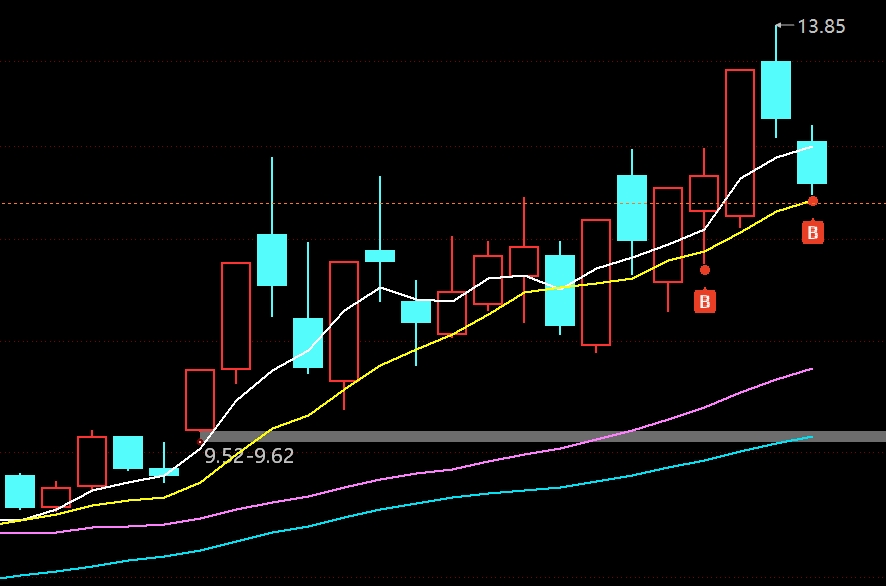
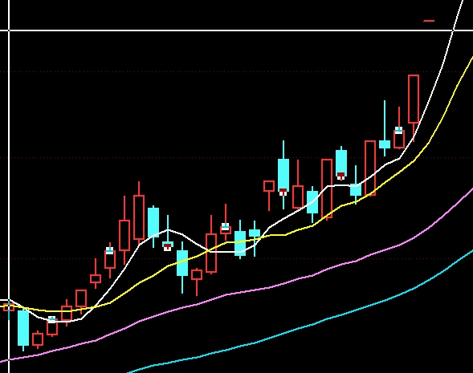

# 20250110

## 盘中

+2卖出华培动力，-3低吸一点点蒙娜丽莎，继续看盘。

华培没有卖在更好的价格，分时的看盘还得练。上午机器人蛮强的，爱仕达想了下还是没去，和巨轮一样，业绩太差怕暴雷。润泽水下直接捞起来了，继续观察。

锋龙大阳线的时限就是今天，你今天不上攻我不会留你到周末的。

海德如果收盘前不能地天那就说明市场的连板情绪还是无法突破7板的空间高度，昨天预测今天连板会有亏钱效应今天应验了。禾望电气这个不知道能不能穿越出来，美邦明天个人也不看好，也不知道今天能不能顶住，反正目前高标观望就行了。

指数不太乐观，又买了一点点蒙娜丽莎，这票独立于指数的，今天不收回来最多挨个周一的低开，目前判断就是缩量洗盘。下午没有开仓计划，处理掉手上的锋龙就好。

<figure><figcaption>
蒙娜丽莎日K
</figcaption></figure> <figure><figcaption>
三维通信日K
</figcaption></figure>

蒙娜丽莎的操盘手法个人理解比较类似三维通信，周三的涨停板是一个进攻的信号，目前要洗掉周三进来的跟风盘。如果我是主力今天会收一个带下影线的中阴线，下周一再低开拉涨停确立升势。当然如果今天下午不回拉，那就说明主力还想在这个位置震荡几天。但是不管怎么操盘原则上不能跌破周三阳线的低点，不然以上的全部逻辑都得推翻。

华培的话因为昨天尾盘的涨停封单结构一般，最后还漏单了，所以今天预期不太高，早上就保守了点分时拉高就卖了，比较贪一点的话能卖在+4的位置差不多。事实上昨天进来的大资金上午就是把价格控制在+4左右慢慢出的。以我目前的认知只能看出华培上午是出货盘口，如果华培下午拉个二板之类的那也和我没啥关系了，只能说认知不够。

锋龙下午这几分钟的量能是一月份以来下午最大的量了，今天可能会动手。华培贱卖了，有点烦。情绪2周期还是有点用的，前几天没几个跌停让追高的尝到甜头今天市场直接一闷棍。游资中午复盘估计统一了意见去搞禾望了，维护高标的生态。
