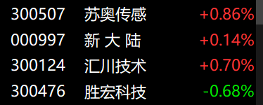

# 20250318

佰维存储白尾村主盘中

卖出中石科技买入苏奥传感和科泰电源。佰维存储突破了，持续关注。

卖出云天励飞买入佰维存储。

当初瞧不起的美利云现在高攀不起了。

以后中线只买5周线附近的得了，A股机构票一天到晚玩假突破。就应该买阴不买阳，做差价得了。

<figure><figcaption></figcaption></figure>

佰维存储一个挺好的周线上涨趋势的票，还没走过加速，今天完成对10月9日最高价的突破，后市还是看涨的，就是里面资金磨磨唧唧喜欢埋伏别人。

浙海昨天早卖了一天少了几个点，这完全就是运气不好了，今天没量还是突破不了。
